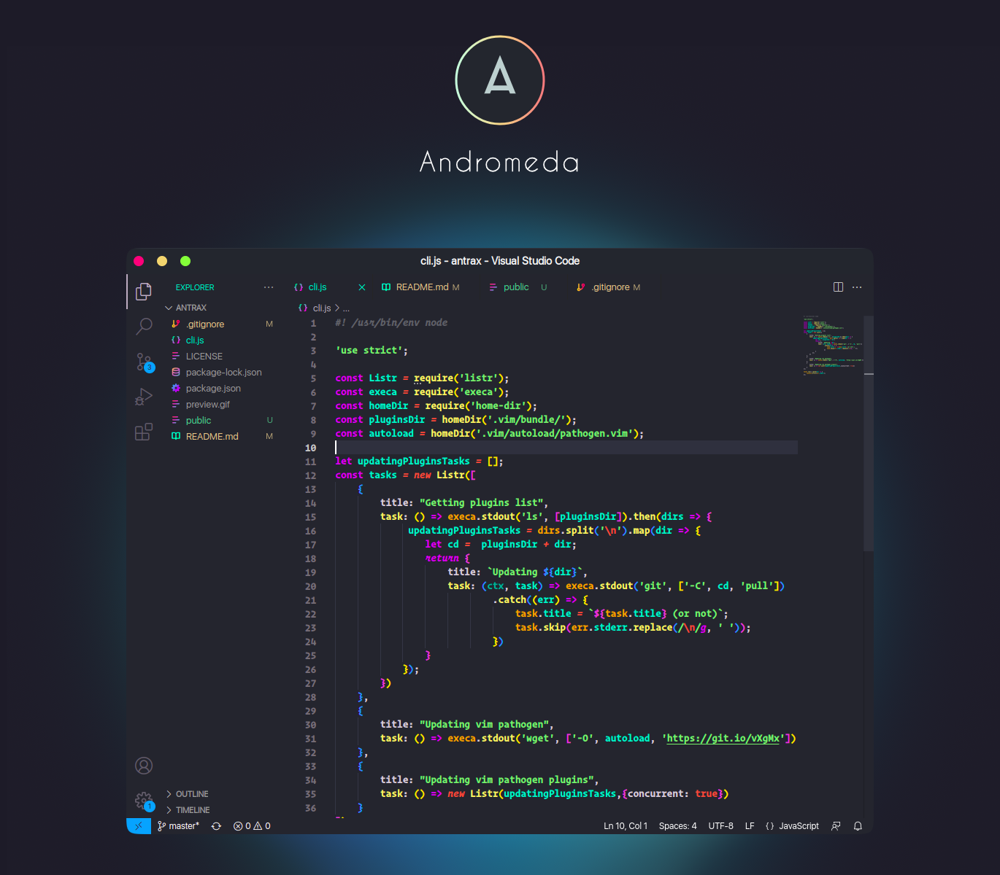
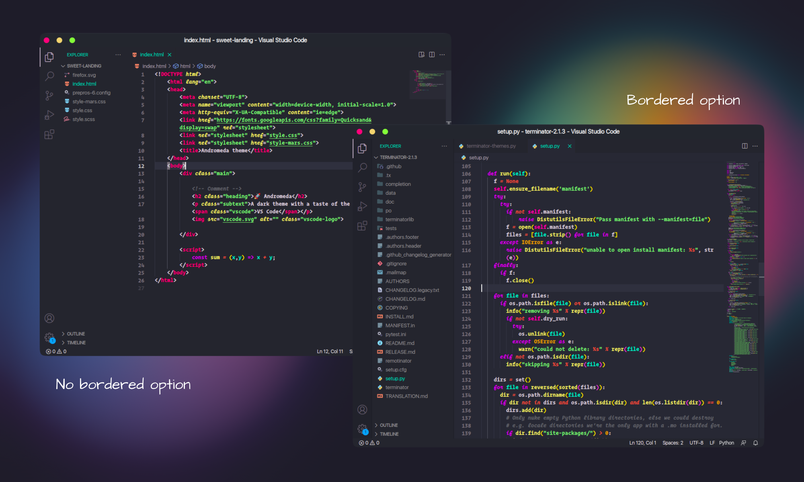

# Andromeda Theme for VS Code
  

> **NOTE**: This theme includes a variant with italic keywords that looks great with fonts like Operator Mono or Catograph Mono

## Easy Installation

1. Open the extensions sidebar on Visual Studio Code
2. Search for **Andromeda Theme**
3. Click **Install** to install it.
4. Click **Reload** to reload your editor.
5. Code/File ＞ Preferences ＞ Color Theme ＞ **Andromeda**.
6. 🌟 Enjoy and [Rate five-stars](https://marketplace.visualstudio.com/items?itemName=EliverLara.andromeda&ssr=false#review-details).
## License

[MIT](https://github.com/EliverLara/Andromeda/blob/master/LICENSE.md)

